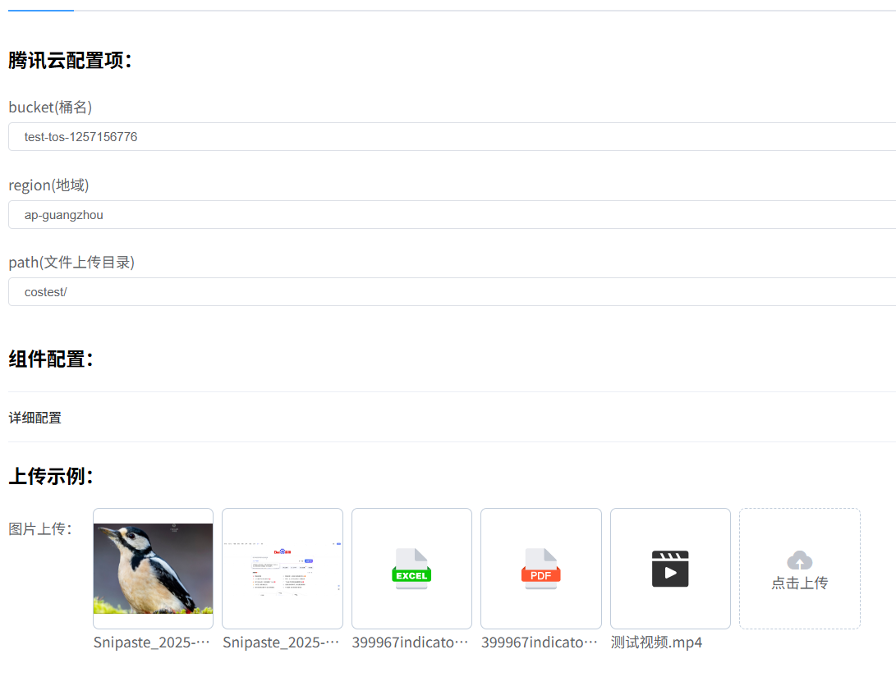
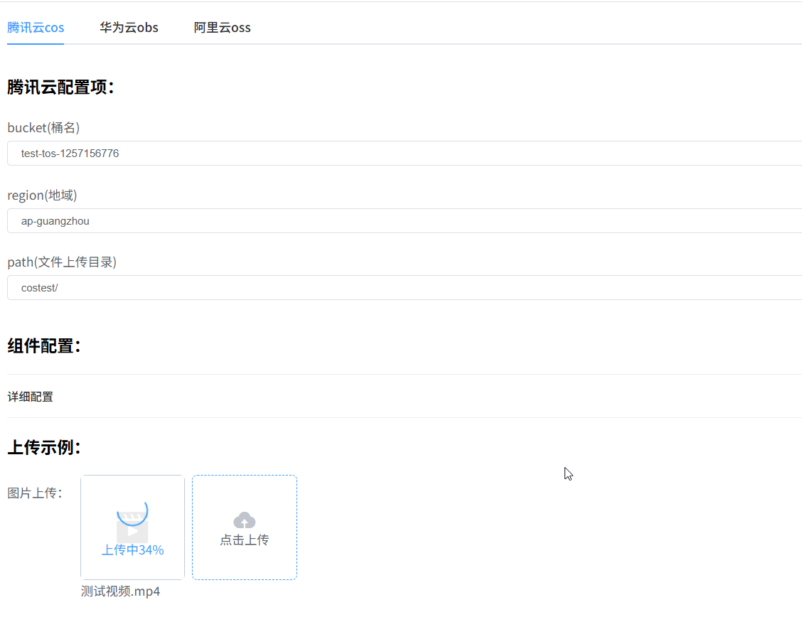
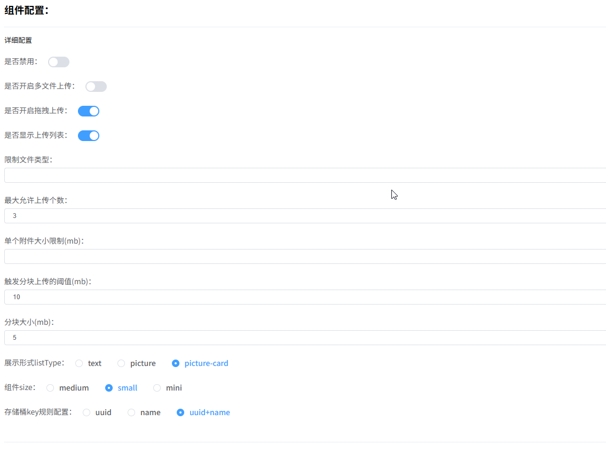
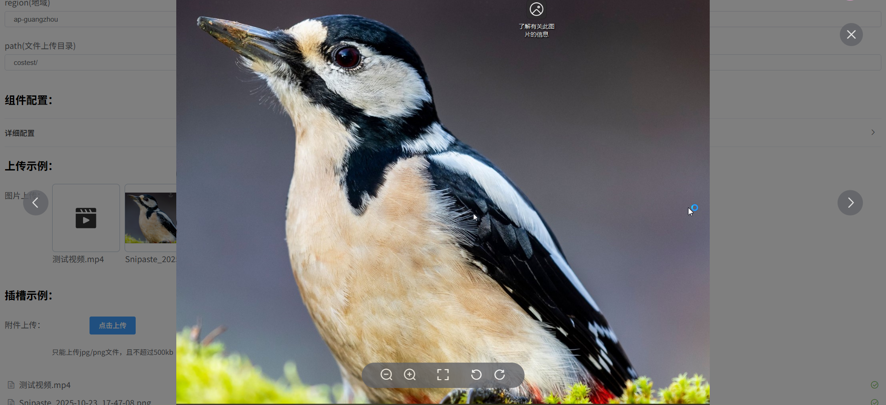
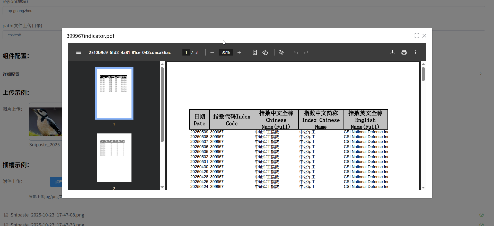

# Vue Cloud Upload

[](https://www.npmjs.com/package/vue-cloud-upload)
[](https://www.npmjs.com/package/vue-cloud-upload)
[](https://www.npmjs.com/package/vue-cloud-upload)
[](https://github.com/Leaderxin/cloud-upload)

🌩 **Vue Cloud Upload** - 专为 Vue.js 打造的专业级云端文件上传组件

一款功能强大、高度可定制的云上传解决方案，完美集成腾讯云COS、华为云OBS和阿里云OSS，提供优雅的UI界面和丰富的功能特性，让文件上传变得简单而高效！

## ✨ 核心特性

- 🚀 **开箱即用**：无缝对接腾讯云COS桶、华为云OBS桶和阿里云OSS桶，快速集成到现有项目
- 🎨 **美观 UI**：基于 Element UI 设计语言，提供一致的用户体验
- ⚙️ **高度可定制**：丰富的配置参数，满足各种业务场景需求
- 👁 **在线预览**：支持图片、TXT、PDF、视频、音频附件直接在线预览/播放
- 📊 **多格式支持**：全面支持各类文件类型上传与展示

## 🔧 现有功能

- ✅ 腾讯云COS桶无缝对接
- ✅ 华为云OBS桶无缝对接
- ✅ 阿里云OSS桶无缝对接
- ✅ 多文件上传支持
- ✅ 自动分片断点续传
- ✅ 上传进度实时显示
- ✅ 文件列表管理
- ✅ 附件回显功能
- ✅ 图片/PDF/TXT在线预览
- ✅ 音视频附件在线播放
- ✅ 自定义样式支持
- ✅ 丰富的参数配置和回调事件
- ✅ 图片添加水印功能（基于Rust + WASM）

## 🚧 开发中功能

- 🔄 图片无损压缩
- 🔄 视频首帧截取
- 🔄 Office 文档在线预览（Word, Excel, PowerPoint）
- 🔄 更多云存储平台支持

## 功能演示

<div align="center">
  <div style="font-size: 0; text-align: center;">
    <div style="display: inline-block; width: 33%; padding: 10px; box-sizing: border-box; vertical-align: top; font-size: 14px;">
      
      <p style="margin-top: 10px; color: #666;">各类文件上传</p>
    </div>
    <div style="display: inline-block; width: 33%; padding: 10px; box-sizing: border-box; vertical-align: top; font-size: 14px;">
      
      <p style="margin-top: 10px; color: #666;">上传进度展示</p>
    </div>
    <div style="display: inline-block; width: 33%; padding: 10px; box-sizing: border-box; vertical-align: top; font-size: 14px;">
      
      <p style="margin-top: 10px; color: #666;">丰富的参数配置</p>
    </div>
    <div style="display: inline-block; width: 33%; padding: 10px; box-sizing: border-box; vertical-align: top; font-size: 14px;">
      
      <p style="margin-top: 10px; color: #666;">视频预览</p>
    </div>
    <div style="display: inline-block; width: 33%; padding: 10px; box-sizing: border-box; vertical-align: top; font-size: 14px;">
      
      <p style="margin-top: 10px; color: #666;">图片预览</p>
    </div>
    <div style="display: inline-block; width: 33%; padding: 10px; box-sizing: border-box; vertical-align: top; font-size: 14px;">
      
      <p style="margin-top: 10px; color: #666;">pdf预览</p>
    </div>
  </div>
</div>

## 安装

```bash
npm install vue-cloud-upload
```
根据您使用的对象存储平台，选择安装对应的SDK依赖：

### 腾讯云 COS
```bash
npm install cos-js-sdk-v5
```

### 华为云 OBS
```bash
npm install esdk-obs-browserjs
```

### 阿里云 OSS
```bash
npm install ali-oss
```
安装相应的SDK后，您可以在组件配置中使用对应平台的参数进行文件上传。

## 组件使用示例

为了更好地组织文档内容，我们将不同云平台的使用说明直接展示在下方，请根据您使用的云平台展开对应的使用说明：

<details>
<summary>腾讯云COS使用说明</summary>

## 全局注册

```javascript
import Vue from "vue";
import COS from 'cos-js-sdk-v5';
import "vue-cloud-upload/dist/vue-cloud-upload.css";
import CloudUpload, { setExternalCOS } from 'vue-cloud-upload';
// 传入腾讯云COS对象
setExternalCOS(COS);
Vue.use(CloudUpload); // 或 Vue.component(CloudUpload.name, CloudUpload);
```

## 按需引入(推荐做法)

```vue
<template>
  <div>
    <CloudUpload
      cloudType="tencent"
      :cloudConfig="cloudConfig"
      v-model="fileList"
      @success="handleSuccess"
      @error="handleError"
    >
    </CloudUpload>
  </div>
</script>

<script>
import COS from 'cos-js-sdk-v5';
import "vue-cloud-upload/dist/vue-cloud-upload.css";
import CloudUpload, { setExternalCOS } from 'vue-cloud-upload';
//传入腾讯云COS对象
setExternalCOS(COS);
export default {
  components: { CloudUpload },
  data() {
    return {
      fileList:[],//附件列表，上传或者删除后实时同步更新
      cloudConfig: {
        //腾讯云cos桶名
        bucket: "test-tos-125***",
        //腾讯云cos桶所在地域
        region: "ap-guangzhou",
        //文件上传目录，自定义，以/结尾
        path: "costest/",
        //此函数为客户端获取临时凭证使用
        getTempCredential: this.getTempCredential,
      }
    };
  },
  methods: {
    /**
     * 调用后端接口返回临时凭证
     */
    async getTempCredential(){
      const response = await fetch('http://localhost:3000/sts')
      const data = response.json();
      return data
      //临时凭证结构应该为如下示例:
      // {
      //   "expiredTime": 1758120268,
      //   "expiration": "2025-09-17T14:44:28Z",
      //   "credentials": {
      //     "sessionToken": "OkiB0nVm0t52UXdyKu0acyK1iw6UhbTa2313c4726bdfa2230aa160cc202e5651kLpfeS8UJsc_4wHB1jPrmywvTJ1KsO0nm9PbEbabQi_D7aahjL5lBJM1DVV7cEZ53AlYq__a07bZ6MKxOIy9CXdGCJF-20xzssYRpukx_MQAhrXKo6cdRi-jXuD-YEe4W-YRXhX4c3x41z8Vb5SQfFoh_THpeFYsaZR_1aPzV22C0UDtI0ru1wiRx-Bw2e9pTHMc0pbvNrYMBuGNt_oEJ0P6fjhCVjLa1BA3KAJen7U6lQqR1UsIRElQAnWqEkG0NCJdPa7nA2pt9COrI58dXiBr9sKXgFcPPhUp9xrAY7-Mx7LuJ6XqgegiBjZeumhNSqIIINadmEjAfWyQfndQKHyxbKRK7h4hCvCV297SVQExnKBO9wkt-Ba0gxpUYj0hgfGCKgvLqG68v1NaIufbR61K5-YlwWA82UFL9PfLIuPR5EAdYgt3-OmM03lZpU22qmq1okkAlNB3wl2Mn03lX4Bx_PKtMZdf8cH2gcUftNjXNwxpMsRdt1U1M9dn_1D3rJy6PE_yqAbGWXOTA5D5c8oP9bW2zUuWgqHbCNU6g8Nvn1wb1hIVIf132T0rfoYP",
      //     "tmpSecretId": "AKID_Duy_4HJP0bS8d3ZG8KsNCMowSm5FxpZr-trO_ayMta5nKI1vr7J3KPOWg_Gu3Bo",
      //     "tmpSecretKey": "3rn/KVRRTGQw5CVFh4IQoqBBm/1LrdvjyFw7YiqbJk8="
      //   },
      //   "requestId": "84fd8060-82a3-4de8-b757-9b22ebabbf7a",
      //   "startTime": 1758116668
      // }
    },
    handleSuccess(result, file) {
      console.log('Upload success:', result.url);
    },
    handleError(err){
      console.log("error:",err);
    }
  }
};
</script>
```
</details>

<details>
<summary>华为云OBS使用说明</summary>

## 全局注册

```javascript
import Vue from "vue";
import ObsClient from 'esdk-obs-browserjs';
import "vue-cloud-upload/dist/vue-cloud-upload.css";
import CloudUpload, { setExternalOBS } from 'vue-cloud-upload';
// 传入华为云OBS对象
setExternalOBS(ObsClient);
Vue.use(CloudUpload); // 或 Vue.component(CloudUpload.name, CloudUpload);
```

## 按需引入(推荐做法)

```vue
<template>
  <div>
    <CloudUpload
      cloudType="huawei"
      :cloudConfig="cloudConfig"
      v-model="fileList"
      @success="handleSuccess"
      @error="handleError"
    >
    </CloudUpload>
  </div>
</script>

<script>
import ObsClient from 'esdk-obs-browserjs';
import "vue-cloud-upload/dist/vue-cloud-upload.css";
import CloudUpload, { setExternalOBS } from 'vue-cloud-upload';
// 传入华为云OBS对象
setExternalOBS(ObsClient);
export default {
  components: { CloudUpload },
  data() {
    return {
      fileList:[],//附件列表，上传或者删除后实时同步更新
      cloudConfig: {
        //华为云obs桶名
        bucket: "cloudupload",
        //华为云终端节点
        server: "https://obs.cn-south-1.myhuaweicloud.com",
        //文件上传目录，自定义，以/结尾
        path: "costest/",
        //华为云临时凭证获取函数
        getTempCredential: this.getObsCredential,
      }
    };
  },
  methods: {
    handleSuccess(result, file) {
      console.log('Upload success:', result.url);
    },
    handleError(err){
      console.log("error:",err);
    },
    //调用后端接口获取临时凭证
    async getObsCredential() {
      const response = await fetch("http://localhost:3000/obs/temporary");
      return await response.json();
      //临时凭证结构为如下示例:
      // {
      //   "credential": {
      //     "access": "HST3WHEHXD7Q5K6WKVR1",
      //     "expires_at": "2025-10-02T05:54:55.606000Z",
      //     "secret": "6P2441bazjE85XzJn6mXxWB8cLmqV77SoU3H76vy",
      //     "securitytoken": "ggpjbi1zb3V0aC0xT4t7ImFjY2VzcyI6IkhTVDNXSEVIWEQ3UTVLNldLVlIxIiwiaXNzdWVkX2F0IjoxNzU5MzgzNTk1NjA2LCJtZXRob2RzIjpbInRva2VuIl0sInJvbGUiOltdLCJyb2xldGFnZXMiOltdLCJ0aW1lb3V0X2F0IjoxNzU5Mzg0NDk1NjA2LCJ1c2VyIjp7ImRvbWFpbiI6eyJpZCI6IjcwMTg0OGZhZGEzNTQwNTk5MmViNTliNjY2NDcyYTlkIiwibmFtZSI6InhpbjE1ODI3MjE1OTk3In0sImlkIjoiNGRkMDc3ZTY0YzQzNGYwY2I4ODViOTgxMDZjMmI4NWMiLCJuYW1lIjoieGluMTU4MjcyMTU5OTciLCJwYXNzd29yZF9leHBpcmVzX2F0IjoiIiwidXNlcl90eXBlIjoxN319nnv4vCNRrXlJxCuXE88_GlHbaDzBg9gt5Ls6UC5PHB70SvqDqt4vUBc1k8Gt6EqoLisyTcq8nn8Sn0rsoI-_KRUz-7Hwp-sdsXi15NVdHTy5mWQsMarKQkkciOQu0ryMIM-H8JKGRRK041qN5EuHnsRv1hi4PP0FPCYxHTOvCzmCrqtzAzLipJt4dHdTI4GtcI5pU296pA8rJf1Nq7VvMjio_9BuaeLccBTEosmijganMRNBqFxnWWSAjets3Qg1fr1U2mpTGKbzZ0Wc8tehfOI0kQdjYUT2T0cGDXMm_Kta9iOmVmydSqWzDzQbNXrzujWNWbrtXfERrU6psu0_JQ=="
      //   },
      //   "httpStatusCode": 201
      // }
    },
  }
};
</script>
```
</details>

<details>
<summary>阿里云OSS使用说明</summary>

## 全局注册

```javascript
import Vue from "vue";
import OSS from "ali-oss";
import "vue-cloud-upload/dist/vue-cloud-upload.css";
import CloudUpload, { setExternalOSS } from 'vue-cloud-upload';
// 传入阿里云OSS对象
setExternalOSS(OSS);
Vue.use(CloudUpload); // 或 Vue.component(CloudUpload.name, CloudUpload);
```
## 按需引入(推荐做法)

```vue
<template>
  <div>
    <CloudUpload
      cloudType="aliyun"
      :cloudConfig="cloudConfig"
      v-model="fileList"
      @success="handleSuccess"
      @error="handleError"
    >
    </CloudUpload>
  </div>
</script>

<script>
import OSS from "ali-oss";
import "vue-cloud-upload/dist/vue-cloud-upload.css";
import CloudUpload, { setExternalOSS } from 'vue-cloud-upload';
// 传入阿里云OSS对象
setExternalOSS(OSS);
export default {
  components: { CloudUpload },
  data() {
    return {
      fileList:[],//附件列表，上传或者删除后实时同步更新
      cloudConfig: {
        //阿里云oss桶名
        bucket: "cloudupload",
        //桶所属地域
        region: "oss-cn-wuhan-lr",
        //文件上传目录，自定义，以/结尾
        path: "costest/",
        //临时凭证获取函数
        getTempCredential: this.getOssCredential,
      }
    };
  },
  methods: {
    handleSuccess(result, file) {
      console.log('Upload success:', result.url);
    },
    handleError(err){
      console.log("error:",err);
    },
    //调用后端接口获取临时凭证
    async getOssCredential(){
      const response = await fetch("http://localhost:3000/oss");
      const data = await response.json()
      //临时凭证获取函数应返回如下三个字段
      const result = {
        accessKeyId: data.AccessKeyId,
        accessKeySecret: data.AccessKeySecret,
        stsToken: data.SecurityToken
      }
      return result;
    },
  }
};
</script>
```
</details>

## 图片水印功能

组件现已支持基于Rust + WASM的高性能图片水印功能，支持文字水印和图片水印。

### **在组件中使用水印配置**：

```vue
<template>
  <CloudUpload
    v-model="fileList"
    :cloud-config="cloudConfig"
    :watermark-config="watermarkConfig"
  />
</template>

<script>
export default {
  data() {
    return {
      fileList: [],
      cloudConfig: {
        // 云平台配置
      },
      // 文字水印配置
      watermarkConfig: {
        type: 'text',
        text: '版权所有',
        font_size: 30,
        font_color: '#000000',
        transparency: 0.5, //不透明度
        rotate: 0, //旋转角度
        x_offset: 10, //X轴偏移
        y_offset: 10, //Y轴偏移
        tile: true //是否循环平铺
      }
    }
  }
}
</script>
```

### 水印配置参数

**文字水印**：
- `type`: `'text'` - 水印类型
- `text`: 水印文字内容
- `font_size`: 字体大小（默认30）
- `font_color`: 字体颜色（默认#FFFFFF）
- `transparency`: 不透明度 0-1（默认0.5）
- `rotate`: 旋转角度（默认0）
- `x_offset`: X轴偏移（默认10）
- `y_offset`: Y轴偏移（默认10）
- `tile`: 是否平铺（默认false）

**图片水印**：
- `type`: `'image'` - 水印类型
- `image_data`: base64编码的图片数据
- `width`: 水印图片宽度（可选）
- `height`: 水印图片高度（可选）
- `transparency`: 不透明度 0-1（默认0.5）
- `rotate`: 旋转角度（默认0）
- `x_offset`: X轴偏移（默认10）
- `y_offset`: Y轴偏移（默认10）
- `tile`: 是否平铺（默认false）

详细使用文档请参考：[图片水印功能使用指南](./WATERMARK_USAGE.md)

## 使用文档

组件详细使用文档请参考【腾讯文档】vue-cloud-upload官方文档
https://docs.qq.com/doc/DT1ZKR2hneG5WdFVT

## 贡献

欢迎提交 Issue 和 Pull Request！

## 商务合作

商务合作请通过邮箱联系：[📧 shazhoulen@outlook.com](mailto:shazhoulen@outlook.com)

## 支持

如果您觉得这个组件有帮助，请给它一个 ⭐️ [Star](https://github.com/Leaderxin/cloud-upload) 支持一下！


## 更新说明
<!-- 自动生成的更新日志开始 -->

### v1.7.6 (2026-05-19)

- feat:picture-card模式下附件达到上限隐藏默认占位内容 (88fb0b7)
- fix:包导出方法中丢失了oss注册方法 (341a154)
- fix:优化组件多实例且动态切换场景下的资源释放逻辑 (cc9d4da)
- 问题修复 (fb61257)
- fix:iframe预览pdf被edge浏览器阻止问题 (9291909)

### v1.7.4 (2026-02-10)

- fix:iframe预览pdf被edge浏览器阻止问题 (9291909)
- fix:primaryColor主题色设置不生效问题
- fix:预览时全屏高度未自动适应问题

### v1.7.2 (2026-01-15)

- doc:官方文档地址更新 (5b39445)

### v1.7.1 (2026-01-08)

- fix:预览组件全局样式污染 (8bcbf8a)

### v1.7.0 (2025-12-30)

- doc:文档更新 (9f4464e)
- feat:fileKey参数更名为keyType；增加customKey参数支持自定义函数生成文件key (23ce0b5)

### v1.6.2 (2025-12-29)

- fix:success事件中v-model值还未更新问题 (7b88147)

### v1.6.0 (2025-11-11)

- 三大云平台，完成支持v-model只传入文件key回显附件

<!-- 最新版本会在这里自动更新 --><!-- 自动生成的更新日志结束 -->

<p align="center">**Vue Cloud Upload** - 让文件上传变得更简单！</p>
<p align="center">
  <a href="https://github.com/Leaderxin/cloud-upload" target="_blank">
    
  </a>
</p>
