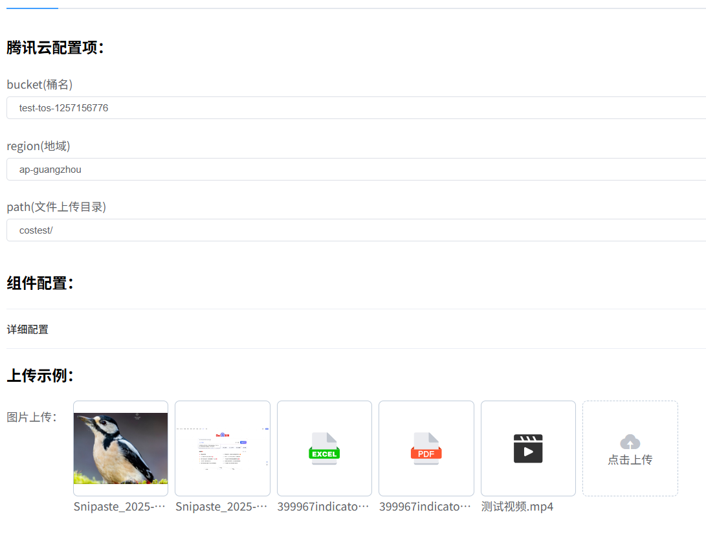
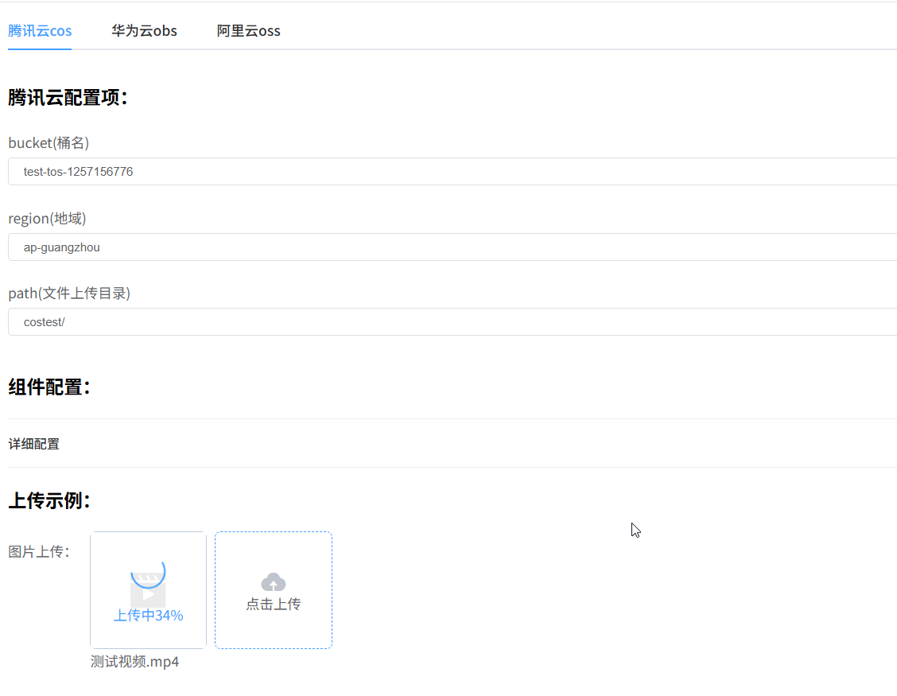
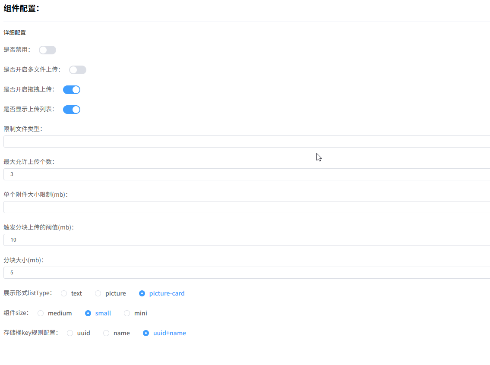
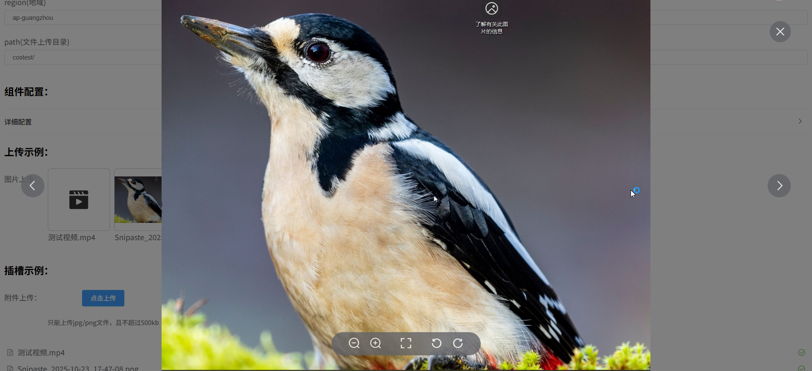
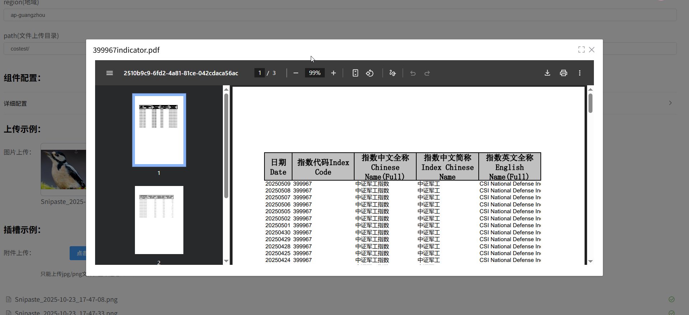

# 🚀 告别繁琐配置！这款 Vue 云上传组件让文件上传变得如此简单

> 前端开发中，文件上传功能几乎是每个项目都绕不开的需求。但你是否也曾为对接腾讯云COS、华为云OBS、阿里云OSS而头疼？是否也曾为分片上传、断点续传、进度显示等功能而熬夜加班？

今天，我要向大家推荐一款**开箱即用、功能强大**的 Vue 云上传组件 —— **vue-cloud-upload**，它将彻底改变你对文件上传的认知！

## ✨ 为什么选择 vue-cloud-upload？

### 🎯 痛点一：三大云平台 SDK 对接繁琐

**传统做法：**
- 需要分别学习腾讯云、华为云、阿里云的 SDK 文档
- 每个平台的 API 调用方式各不相同
- 临时凭证获取逻辑需要自己实现
- 代码冗余，维护成本高

**vue-cloud-upload 的解决方案：**
```vue
<template>
  <CloudUpload
    cloudType="tencent"
    :cloudConfig="cloudConfig"
    v-model="fileList"
    @success="handleSuccess"
  />
</template>

<script>
import COS from 'cos-js-sdk-v5';
import CloudUpload, { setExternalCOS } from 'vue-cloud-upload';

setExternalCOS(COS);

export default {
  data() {
    return {
      cloudConfig: {
        bucket: "your-bucket",
        region: "ap-guangzhou",
        path: "uploads/",
        getTempCredential: this.getTempCredential
      }
    };
  }
};
</script>
```

**只需三步：**
1. 安装对应云平台的 SDK
2. 配置云平台参数
3. 引入组件即可使用！

### 🎯 痛点二：大文件上传体验差

**传统做法：**
- 大文件上传容易失败
- 网络波动需要重新上传
- 用户无法看到上传进度
- 用户体验极差

**vue-cloud-upload 的解决方案：**
- ✅ **自动分片上传**：大文件自动切分成小块上传
- ✅ **断点续传**：网络中断后可继续上传，无需重新开始
- ✅ **实时进度显示**：上传进度实时更新，用户一目了然
- ✅ **分片大小可配置**：根据网络环境灵活调整

### 🎯 痛点三：文件预览功能缺失

**传统做法：**
- 上传后只能看到文件名
- 无法预览图片、PDF、视频等内容
- 需要额外开发预览功能
- 增加开发成本

**vue-cloud-upload 的解决方案：**
- 📸 **图片预览**：支持图片缩放、旋转、全屏查看
- 📄 **PDF 预览**：直接在线查看 PDF 文档
- 🎬 **视频播放**：内置视频播放器，支持在线播放
- 🎵 **音频播放**：支持音频文件在线播放
- 📝 **TXT 预览**：文本文件直接查看内容

## 🌟 核心特性一览

### 1️⃣ 三大云平台无缝对接
- 🅰️ 腾讯云 COS
- 🅱️ 华为云 OBS
- 🅾️ 阿里云 OSS

### 2️⃣ 丰富的功能特性
| 功能 | 说明 |
|------|------|
| 多文件上传 | 支持同时上传多个文件 |
| 拖拽上传 | 支持拖拽文件到上传区域 |
| 文件类型限制 | 可限制上传文件类型 |
| 文件大小限制 | 可限制单个文件大小 |
| 上传进度显示 | 实时显示上传进度 |
| 文件列表管理 | 支持查看、删除已上传文件 |
| 附件回显 | 支持通过文件 key 回显附件 |
| 自定义样式 | 支持自定义上传组件样式 |
| 丰富的事件回调 | 支持上传成功、失败、进度等事件 |

### 3️⃣ 灵活的配置选项
```javascript
cloudConfig: {
  bucket: "your-bucket",           // 桶名
  region: "ap-guangzhou",          // 地域
  path: "uploads/",                // 上传目录
  getTempCredential: async () => { // 获取临时凭证
    const response = await fetch('/api/sts');
    return await response.json();
  }
}
```

### 4️⃣ 多种文件 key 生成策略
- `uuid`：使用 UUID 生成唯一文件名
- `name`：使用原始文件名
- `uuid+name`：使用 UUID + 原始文件名（默认）
- `customKey`：自定义函数生成文件 key

## 📦 快速开始

### 安装组件
```bash
npm install vue-cloud-upload
```

### 安装对应云平台 SDK
```bash
# 腾讯云 COS
npm install cos-js-sdk-v5

# 华为云 OBS
npm install esdk-obs-browserjs

# 阿里云 OSS
npm install ali-oss
```

### 基础使用示例
```vue
<template>
  <div>
    <CloudUpload
      cloudType="tencent"
      :cloudConfig="cloudConfig"
      v-model="fileList"
      :multiple="true"
      :limit="5"
      :maxSize="100"
      @success="handleSuccess"
      @error="handleError"
      @progress="handleProgress"
    />
  </div>
</template>

<script>
import COS from 'cos-js-sdk-v5';
import "vue-cloud-upload/dist/vue-cloud-upload.css";
import CloudUpload, { setExternalCOS } from 'vue-cloud-upload';

setExternalCOS(COS);

export default {
  components: { CloudUpload },
  data() {
    return {
      fileList: [],
      cloudConfig: {
        bucket: "your-bucket",
        region: "ap-guangzhou",
        path: "uploads/",
        getTempCredential: this.getTempCredential
      }
    };
  },
  methods: {
    async getTempCredential() {
      const response = await fetch('/api/sts');
      return await response.json();
    },
    handleSuccess(result, file) {
      console.log('上传成功:', result.url);
    },
    handleError(error, file) {
      console.error('上传失败:', error);
    },
    handleProgress(percent, file) {
      console.log('上传进度:', percent);
    }
  }
};
</script>
```

## 🎨 功能演示

### 各类文件上传


### 上传进度展示


### 丰富的参数配置


### 视频预览


### 图片预览


### PDF 预览


## 💡 实战场景

### 场景一：企业级文件管理系统
```vue
<CloudUpload
  cloudType="aliyun"
  :cloudConfig="cloudConfig"
  v-model="fileList"
  :multiple="true"
  :limit="10"
  :maxSize="500"
  listType="picture-card"
  :previewConfig="{
    image: true,
    pdf: true,
    video: true,
    audio: true
  }"
/>
```

### 场景二：图片上传组件
```vue
<CloudUpload
  cloudType="tencent"
  :cloudConfig="cloudConfig"
  v-model="imageList"
  accept=".jpg,.jpeg,.png,.gif"
  :maxSize="10"
  listType="picture-card"
  :keyType="'uuid'"
/>
```

### 场景三：文档上传组件
```vue
<CloudUpload
  cloudType="huawei"
  :cloudConfig="cloudConfig"
  v-model="docList"
  accept=".pdf,.doc,.docx,.xls,.xlsx"
  :maxSize="50"
  listType="text"
/>
```

## 🔮 未来规划

组件正在持续迭代中，以下功能正在开发中：
- 🔄 图片添加水印
- 🔄 图片无损压缩
- 🔄 视频首帧截取
- 🔄 Office 文档在线预览（Word, Excel, PowerPoint）
- 🔄 更多云存储平台支持

## 📊 项目数据

- ⭐ GitHub Stars：持续增长中
- 📦 NPM 下载量：月下载量稳步上升
- 🎯 支持平台：腾讯云、华为云、阿里云
- 📝 文档完善度：详细的使用文档和示例
- 🐛 问题响应：快速响应和修复

## 🤝 贡献与支持

如果你觉得这个组件对你有帮助，欢迎：
- 给项目一个 ⭐️ [Star](https://github.com/Leaderxin/cloud-upload)
- 提交 Issue 和 Pull Request
- 分享给你的同事和朋友

## 📚 完整文档

更多详细的使用文档和 API 说明，请查看：
- 📖 [官方文档](https://docs.qq.com/doc/DT1ZKR2hneG5WdFVT)
- 💻 [GitHub 仓库](https://github.com/Leaderxin/cloud-upload)
- 📦 [NPM 包地址](https://www.npmjs.com/package/vue-cloud-upload)

## 📧 联系方式

商务合作请通过邮箱联系：[shazhoulen@outlook.com](mailto:shazhoulen@outlook.com)

---

**vue-cloud-upload** —— 让文件上传变得更简单！

如果你正在为文件上传功能而烦恼，不妨试试这个组件，相信它会给你带来惊喜！🎉

---

**相关推荐：**
- [Element UI 官方文档](https://element.eleme.io/)
- [腾讯云 COS 文档](https://cloud.tencent.com/document/product/436)
- [华为云 OBS 文档](https://support.huaweicloud.com/obs/index.html)
- [阿里云 OSS 文档](https://help.aliyun.com/product/31815.html)


